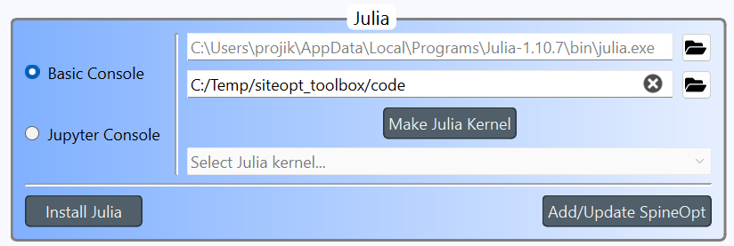

# Installing the Siteopt tool

Installing the Siteopt tool takes place mostly in the command line. You can use command shell such as **cmd** or **Windows Powershell** in Windows or terminal in Linux. You need Spine Toolbox and Julia language for running the Siteopt tool. You also need the Git software. Install them first.

## System requirements

- Windows or Linux operating system
- 16 GB RAM
- network connection for installation

## Spine Toolbox
You need Spine Toolbox for running the Siteopt. In addition, it is needed for using the databases.

- Install Git software (https://git-scm.com/downloads). The installer asks many questions, use the default answers.
- Install Miniconda (https://www.anaconda.com/docs/getting-started/miniconda/install). Add Miniconda to path variable in Windows when asked by the installer.
- Create a Miniconda environment for Spine Toolbox and activate it. I.e., run the following in command prompt:


```
> conda init
> conda create -n spinetoolbox python=3.12
> conda activate spinetoolbox
```


N.B. If you get error CondaError: Run 'conda init' before 'conda activate', run 

```
> source activate base
> conda activate spinetoolbox
```

- Install Spine toolbox as described in https://github.com/Spine-tools/Spine-Toolbox?tab=readme-ov-file#installation-from-sources-using-git


## Python dependencies of the Siteopt tool

- Create a Miniconda environment for Siteopt python dependencies and activate it. I.e., run the following in command prompt:

```
> conda create -n spinedb python=3.11 numpy=1.26.4
> conda activate spinedb
> where python
```

The last command prints the python interpreter path, which you should make note of. The command is applied in Windows. In Linux use "which python". If several paths are shown, make note of the one which is under miniconda/envs. Next install the Spine DB API (https://github.com/spine-tools/Spine-Database-API) and Scikit learn extra (https://scikit-learn-extra.readthedocs.io/en/stable/install.html)

```
> pip install git+https://github.com/spine-tools/Spine-Database-API.git
> conda install -c conda-forge scikit-learn-extra
```

Exit the command prompt.


## Julia language

Install Julia language Install at version 1.10 (recommended) or newer. See https://julialang.org/downloads/ for instructions.


## Downloading the Siteopt tool

Install Git software (https://git-scm.com/downloads) (if not already installed). The installer asks many questions, use the default answers. Check the URL of the siteopt repository by logging into extgit.vtt.fi. Press the "Code" button to see the address. Use the one which begins with https. 

Select an empty folder in your machine. It can be in a different location than the Spine Toolbox installation folder. Start command prompt and run

```
git clone https://extgit.vtt.fi/siteopt/siteopt_toolbox.git
```

(replace ... by the actual URL). (Notice that you need user rights for this repository.)

You will now have a **siteopt_toolbox** folder.

## Siteopt Julia dependencies installation

Go to Siteopt **code** folder of siteopt_toolbox and start Julia console (type "julia" in command prompt). Do not use the same console which you used for Spine Toolbox installation (open a new one). The packages needed by the Siteopt Julia scripts need to be installed. Run commands:
  
```
Using Pkg
Pkg.activate(".")
Pkg.add(url="https://github.com/spine-tools/SpineOpt.jl.git", rev="elexia")
Pkg.add(url="https://github.com/spine-tools/SpinePeriods.jl.git", rev="clustering")
Pkg.resolve()
Pkg.instantiate()
```	
Rebuilding Julia PyCall package is needed to be able to connect to the databases. This is done by running the following commands in Julia console:

```
using PyCall
ENV["PYTHON"] = raw"C:\path\to\your\python\python.exe" #(replace the path by the Python executable in the Miniconda environment where you installed Spine Toolbox )
Pkg.build("PyCall")
```
You can find the Python path as explained in the Python dependencies of the Siteopt tool section. You can now exit Julia session.
l
## Input data

Check that you have all the necessary input files in the **current_input** subfolder of siteopt_toolbox. Make the current_input folder and open a command prompt there. Run command

```
git clone https://extgit.vtt.fi/siteopt/siteopt_data.git .
```

## Running the Siteopt tool

Spine Toolbox provides a graphical user interface for running SpineOpt and editing databases. 

Activate the proper Miniconda environment, which you used to install Spine Toolbox. Start Spine Toolbox by command

```
> conda activate spinetoolbox
> spinetoolbox
```

in console (e.g. "cmd" in Windows).

### Settings

Install SpineOpt plugin (Plugins->Install plugin…, select SpineOpt). 
Now Open the Siteopt toolbox project (File->open). You select a folder, not a file when opening a project.
Go to File->Settings. Go to Tools tab. Check that in **Julia** box the second line points to the **code** folder (See figure below but the path can be different in your computer).




### Preparing the databases

Select each of the databases one at a time. In "data store properties" click "New Spine db" to create a database file for the database. A new dialogue opens. Click "Save". Do this to the following databases:

- Input data
- Input with repr periods
- Output db

Click File->Save project.

### Correcting links

(This part should be done automatically later). Click the following links and make sure that in "Link properties" the scenario filter checkboxes are unchecked.

- Link from Input data to Select repr periods
- Link from Input with repr periods to Extract results
- Link from Input data to Extract results (full period run)
- Link from output db to Extract results (full period run)
- Link from output db to Extract results

Click File->Save project.
