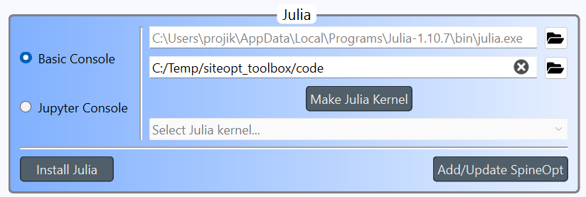

# Installing the Siteopt tool

Installing the Siteopt tool takes place mostly in the command line. You can use command shell such as **cmd** or **Windows Powershell** in Windows or terminal in Linux. You need Spine Toolbox and Julia language for running the Siteopt tool. 

## System requirements

- Windows or Linux operating system
- 16 GB RAM (depending on the models which you run more can be needed)
- network connection for installation

## Spine Toolbox installation
You need Spine Toolbox for running the Siteopt. To install it, first:

- Install Miniconda (https://www.anaconda.com/docs/getting-started/miniconda/install). Add Miniconda to path variable in Windows when asked by the installer.
- Create a Miniconda environment for Spine Toolbox and activate it. I.e., run the following in command prompt:


```
> conda init
> conda create -n spinetb python=3.12
> conda activate spinetb
```

N.B. If you get error CondaError: Run 'conda init' before 'conda activate', run 

```
> source activate base
> conda activate spinetb
```

- Install Spine toolbox:

```
> python -m pip install spinetoolbox 
> where python
```

The last command prints the Python interpreter path, which you should make note of. The command is applied in Windows. In Linux use "which python". If several paths are shown, make note of the one which is under **miniconda/envs**. 

Exit the command prompt.


## Julia language

Install Julia language Install version 1.10 or 1.11. See https://julialang.org/downloads/ for instructions.


## Downloading the Siteopt tool

Select an empty folder in your machine. It can be in a different location than the Spine Toolbox installation folder. Make a **siteopt_toolbox** folder there. 

Go to [https://github.com/vttresearch/siteopt_toolbox](https://github.com/vttresearch/siteopt_toolbox) and from the green "Code" icon select download zip. Unpack the zip file into the siteopt_toolbox folder. 


## Siteopt Julia dependencies installation

Go to Siteopt **code** folder of siteopt_toolbox and start Julia console (type "julia" in command prompt). Do not use the same console which you used for Spine Toolbox installation (open a new one). The packages needed by the Siteopt Julia scripts need to be installed. Run commands:
  
```
Using Pkg
Pkg.activate(".")
```

Rebuilding Julia PyCall package is needed to be able to connect to the databases. This is done by running the following commands in Julia console:

```
ENV["PYTHON"] = raw"C:\path\to\your\python\python.exe" #(replace the path by the Python executable in the Miniconda environment where you installed Spine Toolbox )
Pkg.build("PyCall")
```
You can find the Python path as explained in the Python dependencies of the Siteopt tool section. Next add the correct version of the optimization tool:

```
Pkg.add(url="https://github.com/spine-tools/SpinePeriods.jl.git", rev="clustering")
Pkg.add(url="https://github.com/spine-tools/SpineOpt.jl.git", rev="elexia")
Pkg.instantiate()
```

You can now exit Julia session.

## Input data

Check that you have all the necessary input files in the **current_input** subfolder of siteopt_toolbox. Make the current_input folder if it does not exist. Download or copy your input data to the current_input folder. Ask your optimization model provider for the data. Example input data has been provided in (TBC).

## Running the Siteopt tool via Toolbox

Spine Toolbox provides a graphical user interface for running SpineOpt and editing databases. To run it, activate the proper Miniconda environment, which you used to install Spine Toolbox. Start Spine Toolbox by command

```
> conda activate spinetoolbox
> spinetoolbox
```

in console (e.g. "cmd" in Windows).

### Adjusting Toolbox settings

Now Open the Siteopt toolbox project (File->Open project...). You select a folder, not a file when opening a project. Locate the siteopt_toolbox folder.
Go to File->Settings. Go to Tools tab. Check that in **Julia** box the second line points to the **code** folder (See figure below but the path can be different in your computer).




### Correcting links

(This part should be done automatically later). Click the following links and make sure that in "Link properties" the scenario filter checkboxes are unchecked.

- Link from Input data to Select repr periods
- Link from Input with repr periods to Extract results
- Link from Input data to Extract results (full period run)
- Link from output db to Extract results (full period run)
- Link from output db to Extract results

Click File->Save project.
