# User guide

## Introduction 

Siteopt can represent detailed interactions between buildings, local energy production, storage, and the wider grid, allowing planners to explore how different technologies and operating strategies perform over time. By capturing temporal variability such as hourly demand, weather‑driven renewable output, and dynamic electricity prices, Siteopt helps identify cost‑efficient, low‑carbon solutions for heating, cooling, and electricity supply. Its modular structure also makes it easy to test future scenarios, compare investment options for sustainable district‑level energy planning.
 
## Standard workflow

The standard workflow for Siteopt usage can be outlined as follows:

* Visualizing the model topology and needed entities in one's own mind or paper
* Preparing the input data in form of excel files and CSV files
* Moving the input files to the **current_input** folder of a Siteopt installation
* Starting Spine Toolbox and building the model database
* Optionally selecting representative time periods
* Running optimization
* Compiling result summary
* Analyzing results

## Visualizing the model topology and needed entities

It is important to understand the way energy systems are abstracted in Siteopt. Abstraction can be a bit daunting at first but it allows the Siteopt to model a wider variety of systems instead of limiting to a very restricted set of components. The key idea in the abstraction is that Siteopt uses only a few simple basic components but parameters are used to modify them so that they can resemble various real life components. Let us now see what these basic components are and what they can be used for. Let us use the following simple example system for this.

Figure: Example energy system with two loads. {#fig-energy}

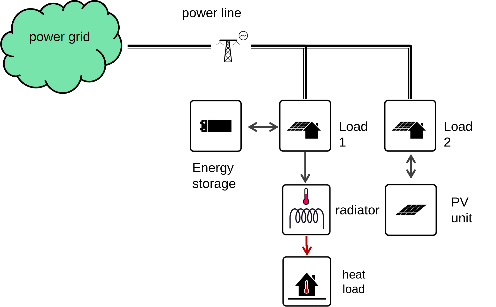{title=""}

In the example you can see different Siteopt components. They have been described in the table below.

Table: Siteopt components.

 Component    | Example icon | Description 
--------------|----------|----------
Node | { width="80" } | Node is a place where energy flows meet and demand can take place. This can for example be a consumer point, point of exchange with another subsystem. Often used interchangeably with "block". Indeed, nodes define locations in the model.
Renewable unit | { width="80" }| Renewable units produce either electricity or heat. The production is sent to a specified node.
Power-to-heat unit | { width="80" } | Power-to-heat units produce either heat or cooling using electricity. 
Connection | { width="80" } | Connections allow energy transmission. They can be e.g. transmission lines or pipelines.
Storage | { width="80" } | Storages allow energy storage. They can be storages for heat, electricity or cold.
Diverting unit | { width="80" } | unit which produces side streams such as emissions.

Note that in the [example system](#fig-energy) the power grid and loads are also nodes. This is precisely what we mean by using a restricted set of components to model many different real-world items. With these components it is possible to model quite a few different systems. The user should rely on these components when visualizing the model topology. In practise, the recommended steps are:

- Decide the energy vectors which are taken into account: electricity, heat or cooling
- Decide the spatial resolution of demand modelling. For example, does the model "block" refer to a single building, city block or wider area?
- Think about where the whole system is connected to external energy supply, if there is one.
- Think about the grid connections and their detail: is every block connected directly to the external energy supply, is the grid more complex?

## Important concepts

Table: Important concepts in Siteopt

Concept   |  Description 
--------------|----------
Model | The optimization model which will be created from the user inputs. It holds parameters such as model horizon and time resolution.
Block | City block or other location for units. Often used interchangeably with "node".
Subunit | Unit of investment for renewable generators, storages and other unit. The user decides the size of subunit. It can be one kW of installed power but also other values are possible.
Alternative | A distinct value for certain parameters. For example there can be Base alternative for investment cost and another alternative with lower investment cost.
Scenario | Possible realization of all parameters. Composed of one or more alternatives. For example, a scenario may manifest lower investment cost but at the same time lower energy prices.

Siteopt allows scenario analysis. However, scenarios are inputted in a smart way so that you only need to enter the parameters which change between scenarios. There's no need to repeat every parameter value for every scenario. The following picture shows how alternatives are used to help scenario analysis.

Figure: Parameter values used in the optimization are different in each scenario. Scenarios contain alternatives in certain order. Parameters may hold a different value for each alternative. The alternative with the highest order prevails. {#fig-simple-system}

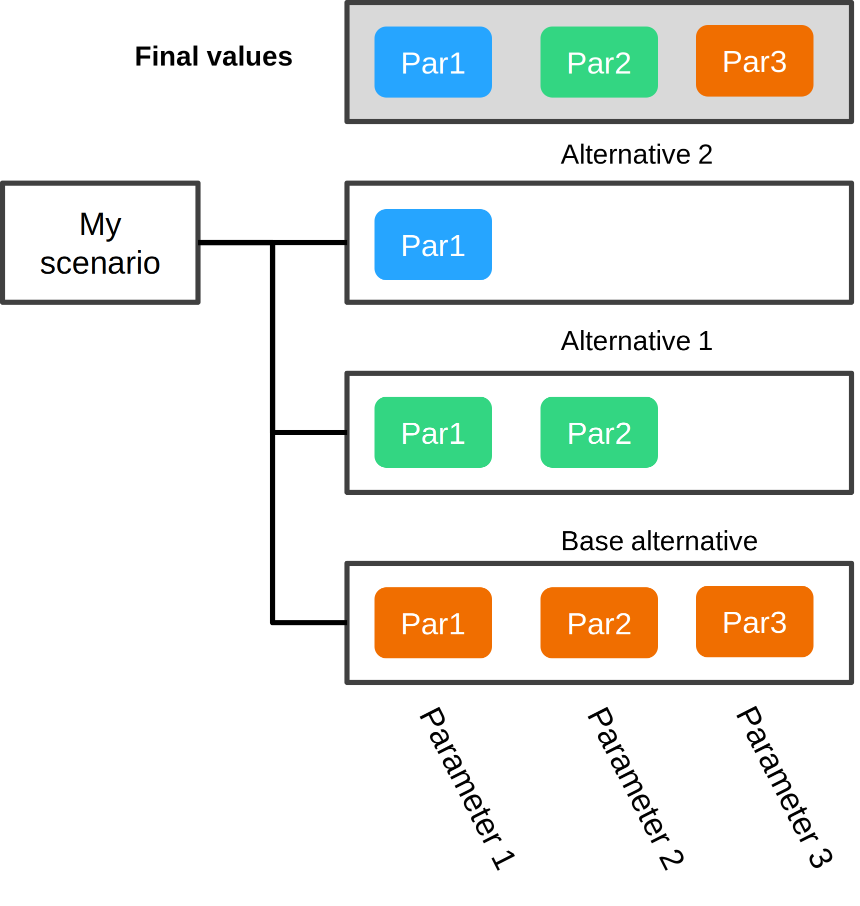{width="400"}

In the picture the scenario "My scenario" contains two alternatives in addition to the Base alternative. Alternative 2 has the highest priority, which makes it override all other values. However, it has only been defined for Parameter 1. Alternative 1 overrides the Base value of Parameter 2.


## Preparing the input data 

The input is mostly given as Microsoft Excel files. Timeseries files are given in comma separated value (CSV) format. The following input files are expected to lie in the **current_input** folder:

 Subfolder    | Filename |Notes
-------------|----------|----------
 nodes/   | nodes.xlsx  |  node listing and their parameters 
 demand/  | tscr_cooldemand.csv  | cooling demand timeseries in SpineOpt format 
 demand/  | tscr_elecdemand.csv | cooling demand timeseries in SpineOpt format 
 demand/  | tscr_heatdemand.csv | heat demand timeseries in SpineOpt format 
 other_units/   | divertingunits.xlsx  |  special units which create branching flows 
 production/   | pv-input.xlsx  |  PV and other variable generation unit parameters 
 production/   | hp-input.xlsx  |  heat pump and chiller unit parameters 
 connections/ |  connections_input.xlsx | Connection entity parameters 
 storages/  | storages-input.xlsx  |  storage unit parameters 
   | modelspec.xlsx  |  model time horizon parameters 
   | scenarios.xlsx  |  study scenarios definition 
 
!!! info "Important Information"
    It is recommended that you start with an example data set an modify it as needed. 

In addition there are two JSON files in the root folder : **repr_settings_elexia.json** and **representative_periods_template.json**. The user is normally not expected to touch these.

Not all of the files are expected to containt data. In that case just leave the header row (first row) in the file. In addition to the above mentioned files, the user can also add additional timeseries as CSV files. They can be referenced from the Excel files as explained below.

In the following we will go through each of the files and show how to fill them.

### The nodes table

In **nodes.xlsx** each row represents one node. However, you can give several alternative parameter values for a node, and in this case each alternative makes one row. Also, you have to define the different grids for each node. For example if cooling demand exists in a node, you have to add a row where grid is "cool".

Table: Nodes table format

| Column           | Required | Description |
|------------------|----------|-------------|
| node             | x        | Node name or block name |
| grid             | x        | The type of energy transferred: "elec", "heat" or "cool" |
| alternative_name | x        | The alternative which the given values refer to (normally "Base"). Can be left empty if no values are given. |
| balance_type     |          | Can define the node as free node if "balance_type_none" is given. Normally balance accounting is forced in a node, so that energy is not created or does not disappear. "balance_type_none" disables the balance accounting. |
| demand           |          | Demand of energy or material in the node. If constant, just input a number. If it is a timeseries, follow the notation given in section "Entering data". |

Node names should be unique. However, you can use the same name in different grids. Normally nodes keep track of energy balance. However, if one declares **balance_type_none** for balance_type then no such condition is enforced and a "free" node is created.

If you wish to define values (e.g. demand) for different alternatives, add a separate row for each node and alternative. Notice that demand time series can also be inputted as shown in the next section.

!!! info "Important Information"
    Write the grid names exactly the same way in all tables. 
	
!!! info "Important Information"
    The "balance_type_none" value for balance_type should be spelled exactly like here.

Table: Example Nodes table

| node           | grid | alternative_name | balance_type | demand |
|------------------|----------|-------------|---|---|
| n1             | elec        |  | | |
| n2             | elec        | Base | | ts:demand2 |

### Demand data

Demand data for three grids (electricity, heating and cooling) can be given in cross-tabulated CSV files. These are:

* tscr_cooldemand.csv for cooling demand timeseries
* tscr_elecdemand.csv for electricity demand timeseries
* tscr_heatdemand.csv for heat demand timeseries

The format of these files is the following:

 Column header   | Required | Description
 -------------|----------|----------
Objectclass | x | "node" without parentheses
Parameter_name | x | "demand" without parentheses
alternative | x | The alternative which the given values refer to (normally "Base" without parentheses)
time | x | Timestamp in ISO8601 format YYYY-MM-DDTHH\:mm\:SS
n_1_elec |  | Any following columns should have header name of the node in SpineOpt format. It should be preceeded by "n_" then have the cityblock name followed by the grid name e.g. "_elec". The column then contains the actual values.

It is probably obvious to the user that these files are not meant to be populated manually but using spreadsheet software or other software for processing time series data. Note that you don't **need** to input demand data via these files. You can also specify timeseries in the nodes input table. In that case you need a separate file for each node and grid.


### Production units table

In **pv_units.xlsx** the user defines renewable generation units such as PV units and wind turbines or solar collectors.


Column    | Required | Description
 -------------|----------|----------
block_identifier | x | City block name
grid | x | The type of energy produced: "elec", "heat" or "cool" (without parentheses)
name | x | The name of the unit, which can be the same if the unit exists in many blocks
alternative_name | x | The alternative which the given values refer to (normally "Base" without parentheses)
unit_capacity | x | The capacity of one subunit (e.g. kilowatts). Normally here one enters the time series for the capacity factor of the unit.
unit_investment_cost |  | The investment cost of one subunit as annualized cost (e.g. €/kW/year if subunit is 1 kW).
candidate_units |  | The maximum number of subunits which can be built.
representative_unit |  | An "X" indicates that the capacity factor of this unit will be used when selecting the representative periods for optimization.

There are also data related to the supply chain carbon dioxide emissions of the production units:

Column    | Required | Description
 -------------|----------|----------
investment_emission |  | The hourly carbon dioxide emission arising from one subunit (e.g. kg/hour)
emission_cost |  | The cost of these carbon dioxide emissions (e.g. €/kg)

If you wish to define parameter values for different alternatives, add a separate row for each unit and alternative. Below you can see an example of what the renewable production units table can look like. In this example, the unit is producting electricity and the capacity factor (production profile) is given as time series (in a CSV file). The cost of one subunit is 100 monetary units per year and the maximum number of subunits is 40.

Table: Example renewable units table

|block_identifier  | grid | name | alternative_name | unit_capacity | unit_investment_cost | candidate_units | representative_unit |
|------------------|------|------|-----------------|------------|------------|-----------|-----------|
|b1 | elec | basic_pv | Base | ts:pv | 100 | 40 | |

!!! info "Important Information"
    In Siteopt the user should decide the units of measurement. For example the user for power can be kW or MW. Currency unit can be € or Norwegian krone. Any any case, units should be used consistently. 
	

### Heat pumps and chiller units table

In **hp_units.xlsx** the user defines heat pumps and chillers. Unlike renewable generation units (defined in **pv_units.xlsx**) these technologies require electricity to operate.

Column    | Required | Description
 -------------|----------|----------
block_identifier | x | City block name
type | x | The type of energy produced: "heat" or "cool" without parentheses
alternative_name | x | The alternative which the given values refer to (normally "Base" without parentheses)
unit_capacity | x | The capacity of one subunit (e.g. kilowatts). Normally here one enters the time series for the capacity factor of the unit.
unit_investment_cost |  | The investment cost of one subunit as annualized cost (e.g. €/kW/year if subunit is 1 kW).
cop_profile | x | The coefficient of performance (COP) factor (unitless)

### Group potentials table

Normally, investments into different VRE units are independent. However, if for example they share the same area, potentials for certain groups of units can be defined. In **group_potential.xlsx** the user defines aggregated renewable unit investment potentials for PV units and wind turbines or solar collectors. 


Column    | Required | Description
 -------------|----------|----------
block_identifier | x | City block name
grid | x | The type of energy produced: "elec", "heat" or "cool" (without parentheses)
name | x | The name of the unit, which can be the same if the unit exists in many blocks
alternative_name | x | The alternative which the given values refer to (normally "Base" without parentheses)
group | x | The name of the group for which an investment constraint is given. Can be selected freely.
candidate_units | x | The quantity of total invested subunits allotted to this group.

For example, if you wish to create an aggregated investment constraint which pertains to two different units, add two lines to this file. Input the unit blocks, grids and names as in **pv_input.xslx**. Think of a descriptive and unique name for this constraint and put it into the `group`column on both lines. On one (not both) of the lines in `candidate_units` columns, write the maximum number of subunits which can be invested.

### Connections table

In Siteopt and SpineOpt connections are entities which can transfer energy and material from one node to another. These include power lines and pipelines. However, as Siteopt works in an abstract level, it does not require that you specify what type of real infrastructure the connection represents. Instead you enter parameters which determine how these connection behave.

In **connections_input.xlsx** each row represents one connection entity. The header row shows what is expected on each column. The columns are as follows:

 Column    | Required | Description
 -------------|----------|----------
node1 | x | The originating city block of the connection.
node2  | x | The destination city block of the connection.
grid | x | The type of energy transferred: "elec"  (electricity), "heat" (heating) or "cool" (cooling) .
alternative_name | x | The alternative which the given values refer to (normally "Base").
connection_flow_cost |  | The unit cost of energy or material transfer, e.g. €/kWh.
connection_flow_cost.mul |  | Multiplier for the unit cost of energy or material transfer, e.g. to convert between units between the model and input data.
connection_flow_cost_reverse |  | The unit cost of energy or material transfer in reverse direction (i.e. from node 2 to node 1).
connection_flow_cost_reverse.mul |  | Multiplier for the unit cost of energy or material transfer in reverse direction
efficiency |  | Transfer efficiency (e.g. 0.95 meaning 95 %) dictates how much of the transfed quantity reaches the destination and how much is lost.


### Storages table

In **storages-input.xlsx** the user defines electricity, heat and cold storages.

Column    | Required | Description
 -------------|----------|----------
block_identifier | x | Block name (node name).
type | x | The type of energy produced: "heat" or "cool" 
alternative_name | x | The alternative which the given values refer to (normally "Base")
node_state_cap | x | Storage capacity (e.g. kWh) of one storage subunit
max_charging | x | Charging capacity (e.g. kW) of one storage subunit
max_discharging | x |Discharging capacity (e.g. kW) of one storage subunit
demand  |  | Possible energy demand drawn directly from the storage
unit_investment_cost | x | Annualized investment cost of the charger/discharger (per subunit)
storage_investment_cost | x | Annualized investment cost of storage section (per subunit)
candidate_units | x | Maximum number of charger/discharger subunits
candidate_storages | x | Maximum number of storage section subunits

The storage table is more complex than the other tables because the power conversion section (charger and discharger) is defined separately from the actual storage. Thus an investment cost is given both from the storage **capacity** and charger **power**. These are given for one subunit on an annual basis as usual. The maximum number of subunits is be given both for the storage section and charger section. Normally it is convenient to define one subunit as kW or MW for charger and kWh or MWh for the storage section but they may also be defined e.g. according to certain battery model if it is convenient for the user.

### Diverting units table

At the time diverting units are mostly used for internal accounting purposes of the optimization model because the underlying SpineOpt model does not account for emissions. Nothing prevents their use by the user. The user should, however, tolerate the bit more complex notation used for these units.


### Modelspec table

The **modelspec.xlsx** file contains five sheets but only two of them are normally needed by the user. **params_1d_datetime** contain the following data about the model time horizon:

Column    | Required | Description
 -------------|----------|----------
objectclass | x | enter text `model`
object | x | enter text `mymodel`
parameter_name | x | either `model_start` or `model_end`
alternative_name | x | The alternative which the given values refer to (normally `Base`)
parameter_value | x | The model start or end time in YYYY-MM-DDTHH\:mm\:ss format

In other words, here you adjust which parts of the given time series are used for optimization. **params_1d_durations** sheet contain data about the time resolution used by optimization. Normally it contains two rows. One of the rows determines the time resolution used in the day-to-day optimization of the system. The other defines how often investments can be made. Presently Siteopt supports only a single investment for each entity, so the time resolution for investments should be longer than the model horizon.

Column    | Required | Description
 -------------|----------|----------
objectclass | x | enter text `temporal_block`
object | x | enter text `myblock` or `myinvestmentblock`
parameter_name | x | enter text `resolution`
lternative_name | x | The alternative which the given values refer to (normally `Base`)
parameter_value | x | The model time resolution (normally 1 hour `1 h`for `myblock` and 1 year `1 Y` for `myinvestmentblock`

It is suggested that you keep the values as  `1 h`for `myblock` but you may increase the value to several hours to speed up computation. For `myinvestmentblock` you can use e.g. `1 Y`.

### Scenarios table 

The **scenarios.xlsx** file contains three sheets. The **scenario** sheet just lists the different scenario names in the first column (first row just is header row). Likewise the **alternative** sheet lists different alternatives in the first column, where the first row is header row. **scenario_alternative** sheet is more complex and has two kind of entries. On this sheet, the first column (A) is reserved for scenario names and two next columns (B-C) for alternative names. When two columns (A and B) are filled, this has the meaning that an alternative belongs to a scenario. When three columns (A, B and C) are filled, this has the meaning of defining the order of alternatives. In this case the alternative written in column C has higher precedence and alternative written in column B. If There are more than 2 alternatives in any scenario, more rows should be used to define the order of the alternatives.

The following picture shows an example.

Figure: Inputting alternatives for each scenario. One first has to list each alternative for each scenario. Then one has to specify the order of the alternatives. Here `Highprice`alternative overrides the `Base` alternative in `Myscen` scenario.

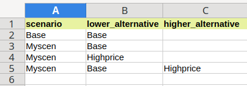{width="400"}

## Entering data

You will need different types of data for different parameter indices and values. The following datatypes can be entered in the input tables.

| Type        | Example |Notes|
|-------------|----------|----------|
| text        | n_7_elec   | use letters, numbers and underscores |
| number     | 7.1       | scientific notation such as 1.0e3 is also allowed |
| Datetime     | 2025-12-31T13:00:00  | Format YYYY-MM-DDTHH\:mm\:ss |
| Duration     | 3h  | Represents a time duration. The unit can be either `Y` (for year), `M` (for month), `D` (for day), `h` (for hour), `m` (for minute), or `s` (for second). |
| timeseries     | ts:elec7       | always begin with `ts:` |

For datetimes such as time stamps the recommended format is ISO8601 (e.g. 2020-03-01T01:00). In case of timeseries, the actual timeseries data should be placed in a CSV file in the input data folder (same folder as the referencing Excel file). The file should have two columns which have column titles "time" and "value". File name should have the format ts_ + time series name + .csv. For example if you write ts:elec7 in the input data table, file name ts_elec7.csv is expected. Note that Siteopt does not make daylight saving time adjustments.

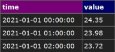{title="Example time series file. Columns should be separated by commas."}

For durations the data should be entered in format xU where x is an integer and U is either Y (for year), M (for month), D (for day), h (for hour), m (for minute), or s (for second). For example "60m".

## Using Siteopt via Spine Toolbox

You can use Siteopt in two ways: via Spine Toolbox or via web browser. Here the first method is explained.

### Introduction to Spine Toolbox

Spine Toolbox is an application, which provides means to define, manage, and execute complex data processing and computation workflows, such as energy system models. It is used as the platform for Siteopt but it can be used for other purposes. For the interested user, the documentation can be found in [Spine Toolbox documentation](https://spine-toolbox.readthedocs.io/en/latest/index.html).

### Starting Siteopt

When using Siteopt via Spine Toolbox first start the toolbox. Run the commands

```
conda activate spinetb
spinetoolbox
```

The first time you start the application you will see the main window like this:

Figure: Spine Toolbox main window.

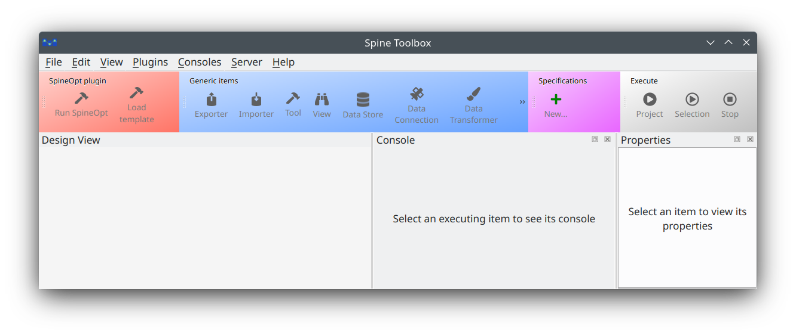{width="100%"}

Then inside Spine Toolbox:

- Open the project folder where you have downloaded Siteopt_toolbox: File -> Open project…
- Navigate to the folder where you have downloaded Siteopt_toolbox
- Press Ok
- If you get a notification to upgrade databases, just upgrade them
- Make sure you also remembered to set Julia settings as described in Installation->Adjust toolbox settings

### Building the database for optimization

The Siteopt inputs need to be translated to a format which is understood by the optimization model. This should be done each time you change the inputs (i.e. the Excel files described above or the time series CSV files).

- Close the input Excel files
- Observe the Design view window in the toolbox
- Using left mouse button held, select everything to the left of the pink ”Input data” box (see figure). It does not matter if you select the blue components or not.
- In the top toolbox press Execute Selection
- Wait until all the hammer tools have a green check mark
- Red cross in tool icon means an error

Figure: To create the input database for optimization, select the red and burgundy components to the left of the Input data by using left mouse button held. {#fig-input-prepa}

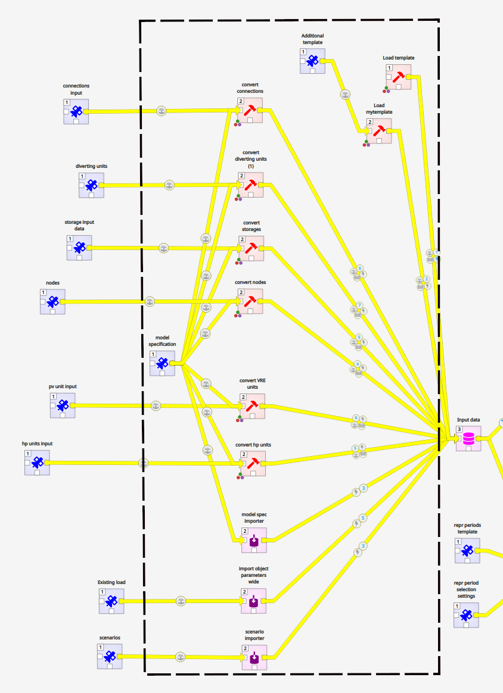{width="95%"}

Figure: The button used to execute the selected component(s) is "execute selection". {#fig-toolbox-execute}

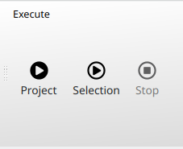{width="300"}

Building the database can take several minutes.

### Running representative periods selection

Representative periods are a way to simplify long‑term energy system studies without losing the big picture. Instead of simulating every hour of an entire year — which would be extremely heavy to compute — the year is broken into a small number of “typical” days that capture the main patterns in demand and renewable generation. Think of it like choosing a few key scenes from a movie that still let you understand the whole story. In Siteopt, you can either use representative periods or not. If you decide to use them, select and run (press Execute selection) the `Select repr periods` component right of the Input data.

Figure: To select representative periods, select the `Select repr periods` component right of the Input data by using left mouse button. {#fig-repre-periods}

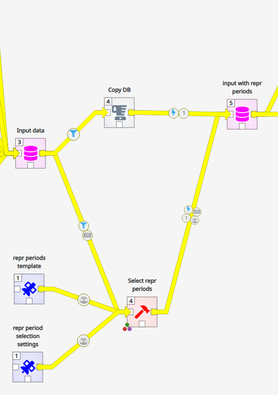{width="400"}


### Running optimization

Optimization of the model can be started by selecting the `Optimize` tool in Toolbox and clicking "Execute selection" in the toolbar. Before this, click the data path coming to the `Optimize` tool from the left. In the link properties window you can now see the scenarios which are selected for optimization. Select the ones you want. If the properties window is not visible, select View menu -> Dock widgets->Link properties.

Figure: To optimize, select the `Optimize` component using left mouse button. {#fig-optimize}

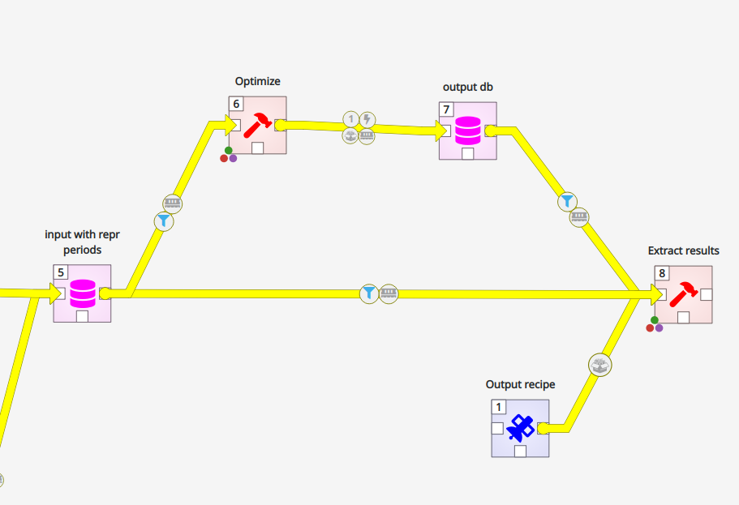{width="400"}

Running the optimization can take anything from a few minutes to tens of minutes. Reducing the number of nodes and optimized units as well as increasing time resolution can reduce the running time.

You can also select the `Extract results` component, which builds an Excel summary of the results, at the same time with optimization or after it. The Excel summary can be accessed by right-clicking the `Extract results` component and selecting "Open results directory". There the results have been arranged according to the run time.

## Using Siteopt via the Siteopt web app

The Siteopt web app provides a more intuitive user interface for Siteopt. It is used via a web browser. The installation steps have been explained in the installation section of the documentation. In the figure below you can see the application window.


Figure: The main window of the Siteopt web app with the data and execution tab open. {#fig-webapp-mainwin}

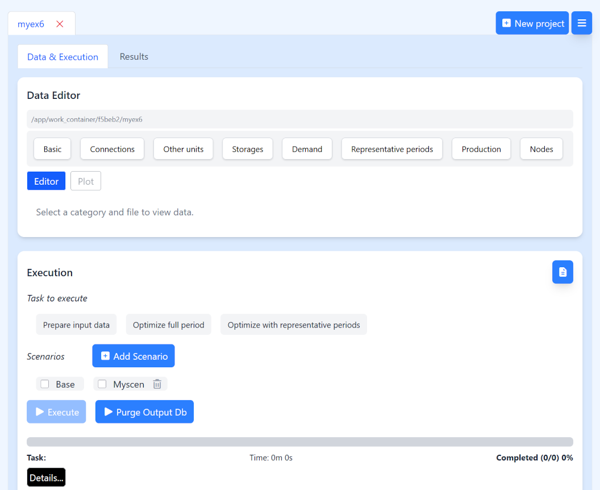{width="95%"}

### Creating projects

On top of the window, you can see that there is a tab called "myex6". This is the project name. You can have many projects, each with their own set of input data and results. You can create a new project by pressing the `New project` button. The program asks which dataset you want to copy as basis. The options are:

- Dokken dataset describing Elexia Dokken pilot;
- Dokken light dataset describing Elexia Dokken pilot (a more compact dataset resulting in a smaller model and shorter run times)
- small example dataset useful for learning

Select the dataset and project name and press "Ok". The project appears as a new tab. You can remove project tab from the window by pressing the X button

!!! info "Important Information"
    When running the development version you must have access to the Git repository holding the Dokken datasets to use them. If you use the production version, the datasets are already included in your software. 

### Editing data

The main window of the Siteopt web app with normally has the data and execution tab open. This tab contains two panes: Data editor and Execution. Data editor lets you view and edit the input data files in the project. These are precisely the files described above. For example, to edit VRE production units, click `Production` button and select "pv-input.xlsx". The Excel file opens in the editor and you can make changes. You can:

- delete a row by ticking the box in front of the row and pressing `Delete selected`
- copy and paste values to/from individual cells
- add new rows to the bottom by pressing `Add row`
- replace the whole file by a file on your computer by pressing first `Browse`, selecting a file of the same name, press `Open` and then `Replace`
- change sheets in the file from the tabs below the data table. This applied only to files which have multiple tabs, such as "modelspec.xlsx".
- save the edited data by pressing `Save` (or CTRL-S)

You will notice that some cells accepts text values, others numeric values (or timeseries references preceeded by "ts:"), and still others a selection of predefined values.

### Running the model

Execution tab lists tasks which you can perform ("Task to execute"). These include:

- Prepare input data: Siteopt inputs need to be translated to a format which is understood by the optimization model. This task builds the input database.
- Optimize full period: performs optimization using the full model horizon defined in modelspec.xslx. Especially for bigger models this can take 10–20 minutes or even more.
- Optimize full period: select samples from the full model horizon defined in modelspec.xslx and then perform optimization. This is normally the faster but less accurate option.

You first select a task and then press `Execute`. Before optimization you also have to select one or more scenarios. During execution the progress bar tracks the execution stage. 

`Purge Output Db` clears the results database to remove clutter and save space.


### Viewing results

On top of the page you can switch to Results dashboard tab. Note that you first have to have some calculated results. Otherwise the tab shows message "Run the model to generate result files." The results are organized by scenario and optimization run time. During each optimization run, results summary is produced for all the results which have been stored in the output database. This is why you may sometimes see quite many scenarios in the figures. You can clear the output database by pressing `Purge Output Db` on the Data & execution tab.

Figure: The results dashborad of the Siteopt web app. {#fig-webapp-resultsdash}

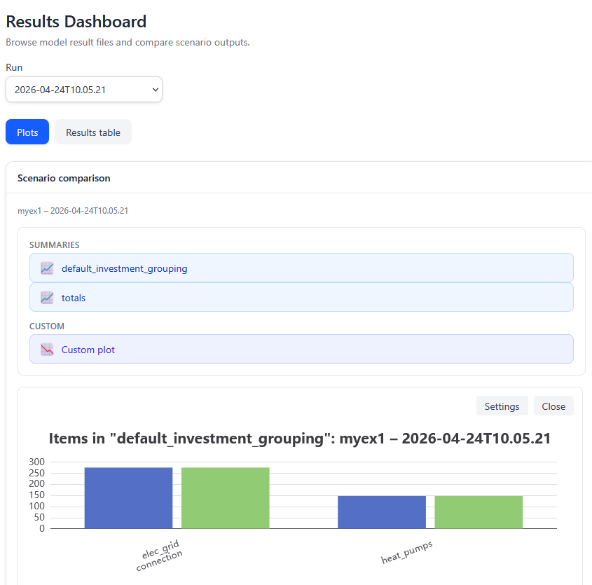{width="95%"}

The figure above shows a screenshot of the results dashboard. There is first a dropdown box for selecting the optimization run. In scenario comparison window you see the project name and the selected run time. In "Summaries" you can select three different types of figures:

- Totals summary (top-level key performance metrics)
- Default investment grouping: total optimized investment into pre-defined entity categories
- Custom plot where you can select the categories and scenarios included.

You can turn on and off the first two figures by clicking their labels in the "Summaries" selection. Clicking the custom plot label takes you to a window where you can select the categories and scenarios included.

The pre-defined entity categories include as categories:

- renewable energy (VRE) units (currently not broken down)
- heat pump and chiller units
- connections of different grids
- storages in different grids

In the results view you cannot view detailed results such as decision variable values at specific time point. However, advanced users can modify the plot figure contents by editing output_recipe.json file in the project data folder.

## Interpreting results


